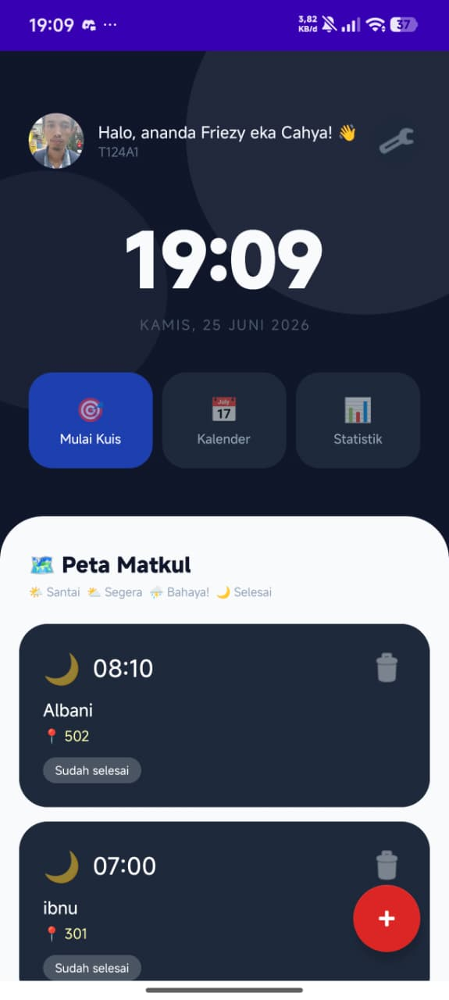
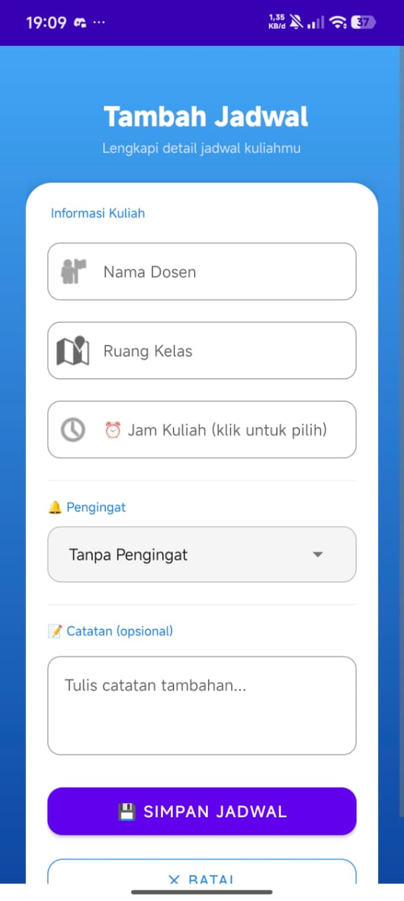
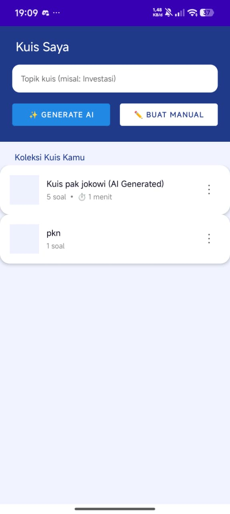
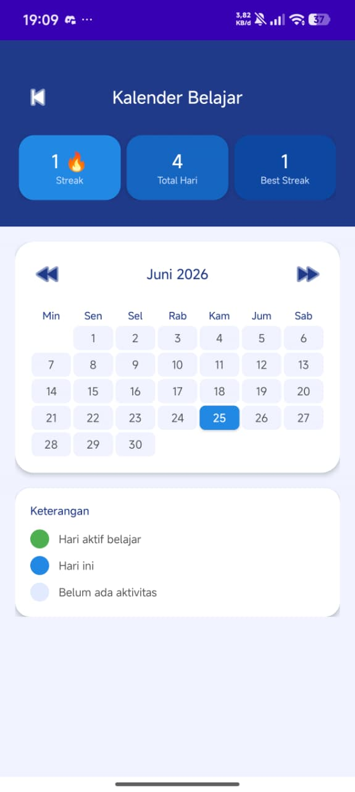
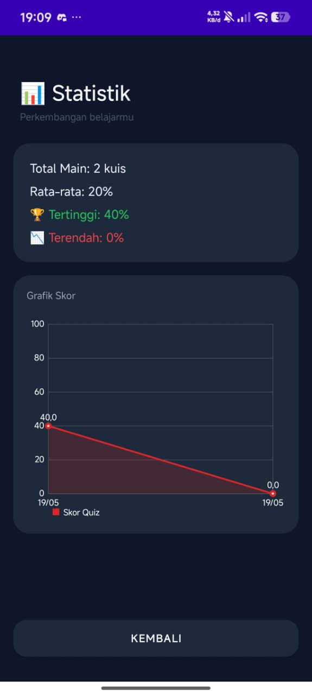
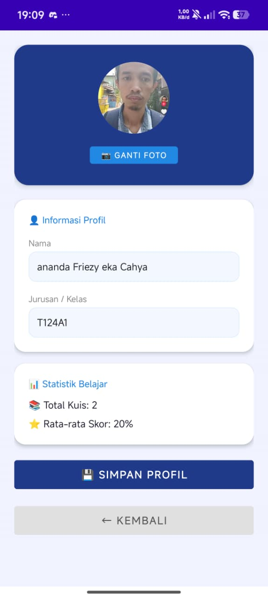

# 📚 StudyMate - Aplikasi Belajar & Jadwal Kuliah

Aplikasi Android untuk membantu mahasiswa mengelola jadwal kuliah, membuat kuis, dan memantau perkembangan belajar secara personal.

---

## 👤 Identitas Mahasiswa

| Info | Detail |
|------|--------|
| **Nama** | ananda Friezy eka Cahya |
| **Kelas** | I241A |
| **Mata Kuliah** | Pemrograman Mobile 2 |
| **Dosen** | Donny Maulana, S.Kom., M.M.S.I. |
| **Universitas** | Universitas Pelita Bangsa |

---

## 📱 Fitur Aplikasi

- 🏠 **Dashboard** — Tampilan utama dengan jam, tanggal, dan peta matkul
- 📅 **Jadwal Kuliah** — Tambah dan kelola jadwal kuliah dengan pengingat
- 🎯 **Kuis** — Buat kuis manual atau generate otomatis menggunakan AI
- 📆 **Kalender Belajar** — Pantau streak dan hari aktif belajar
- 📊 **Statistik** — Grafik perkembangan skor kuis dari waktu ke waktu
- 👤 **Profil** — Kelola data diri dan foto profil

---

## 🖼️ Screenshot UI

### 🏠 Dashboard / Home
Halaman utama menampilkan jam real-time, tanggal, shortcut menu, dan daftar jadwal kuliah (Peta Matkul).



---

### ➕ Tambah Jadwal
Form untuk menambahkan jadwal kuliah baru, lengkap dengan nama dosen, ruang kelas, jam kuliah, pengingat, dan catatan tambahan.



---

### 🎯 Kuis Saya
Halaman kuis yang mendukung pembuatan kuis secara manual maupun generate otomatis berbasis AI berdasarkan topik yang diinput.



---

### 📆 Kalender Belajar
Menampilkan kalender bulanan dengan indikator hari aktif belajar, streak harian, total hari belajar, dan best streak.



---

### 📊 Statistik
Menampilkan ringkasan performa kuis: total main, rata-rata skor, skor tertinggi & terendah, serta grafik skor dari waktu ke waktu.



---

### 👤 Profil
Halaman profil pengguna dengan foto, informasi nama dan kelas, statistik belajar, serta tombol simpan profil.



---

## 🛠️ Teknologi yang Digunakan

- **Android Studio** — IDE pengembangan
- **Kotlin** — Bahasa pemrograman utama
- **SQLite / Room** — Penyimpanan data lokal
- **MPAndroidChart** — Grafik statistik skor

---

## ▶️ Cara Install APK

1. Download file APK di folder `release/` pada repository ini
2. Pindahkan APK ke perangkat Android
3. Aktifkan **"Instal aplikasi dari sumber tidak dikenal"** di pengaturan
4. Buka file APK dan tap **Install**

---

## 📋 SCRUM Board (ClickUp)


> 🔗 [Link ClickUp](https://app.clickup.com/90181774075/v/s/901810071984) 

---

## 📁 Struktur Repository

```
UAS_ANDROID_2_Semester4/
├── app/
│   └── src/main/         # Source code utama
├── screenshots/          # Screenshot UI aplikasi
├── release/              # File APK
└── README.md
```
